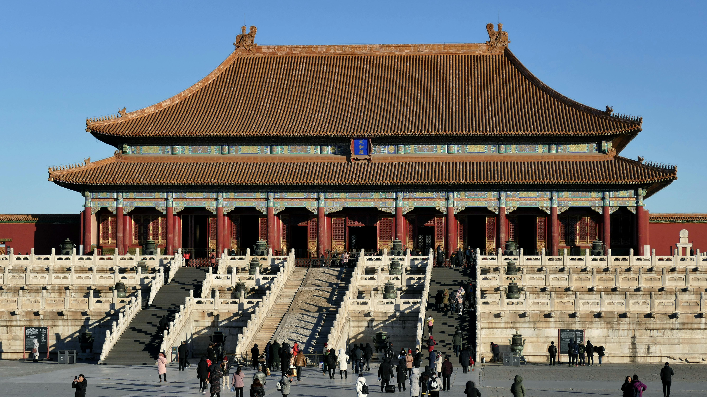
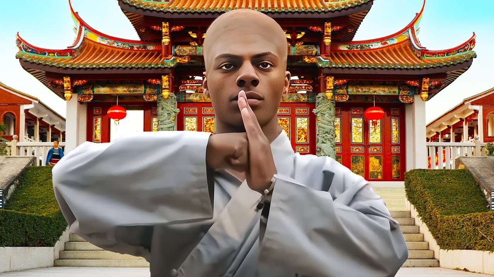
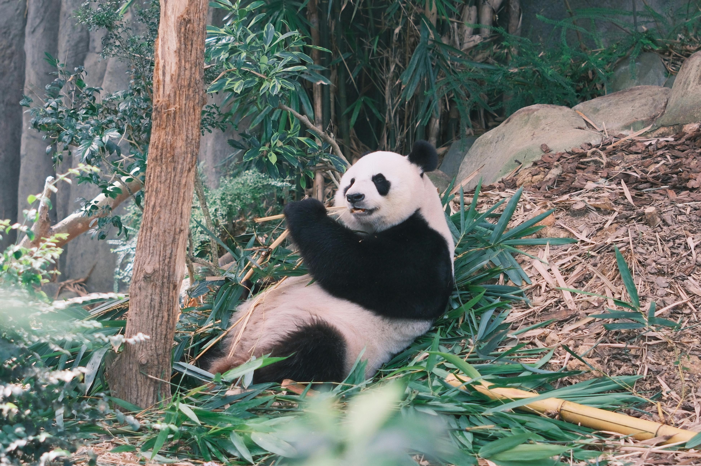
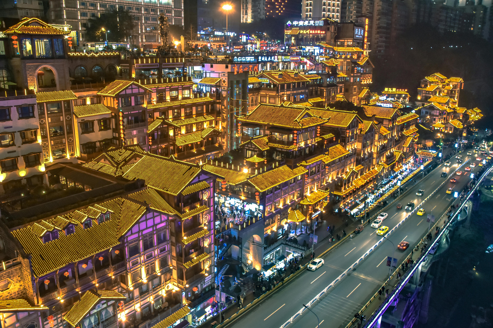
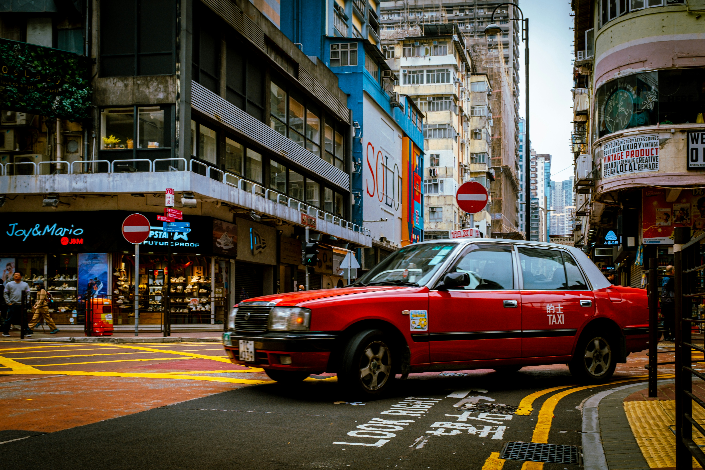
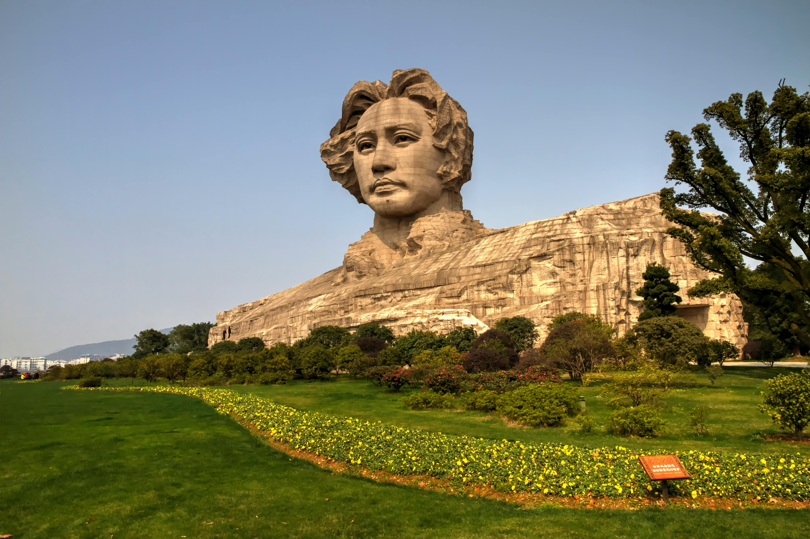

This route takes you through the trending spots made famous abroad by global YouTuber @IShowSpeed.  
跟着 YouTuber @IShowSpeed 游中国，沉浸式体验网红打卡地。

 

**📍 March 24 – Shanghai 上海** 
IShowSpeed kicked off his China journey in Shanghai, the bustling metropolis known for its futuristic skyline and rich street culture.He test-drove the viral Xiaomi SU7 electric car, livestreamed for over 6 hours around The Bund and Nanjing Road, and tasted street snacks like scallion pancakes and fried stinky tofu.Fans gathered mid-stream, creating chaotic but heartwarming scenes. 
  
Notable spots: The Bund 外滩, Nanjing Road 南京路, Oriental Pearl Tower 东方明珠 
Recommended food: Xiaolongbao 小笼包, Pan-fried Pork Buns 生煎包 
  

  

**📍 March 26 – Beijing 北京** 

In the capital, Speed explored the Forbidden City, snapped photos at Tiananmen Square, and played basketball in local parks.His tanghulu mukbang (candied hawthorn) went viral, and he shared laughs with fans at the Great Wall livestream site. 
  
Notable spots: Forbidden City 紫禁城, Great Wall 长城, Wangfujing Street 王府井 
Recommended food: Peking Duck 北京烤鸭, tanghulu 糖葫芦 
 

  
 
**March 28 – Dengfeng 登封 (Shaolin Temple 少林寺)** 
At the birthplace of Shaolin Kung Fu, Speed trained with monks, attempted horse stance, and shouted iconic “WATAAA” moves.He was genuinely impressed by the philosophy of martial arts and shared thoughts with global followers. 
  
Notable spot: Shaolin Temple 少林寺 
Recommended experience: Shaolin Kung Fu class 武术体验 
 

  

**📍 March 31 – Chengdu 成都** 
Chengdu welcomed Speed with panda souvenirs and peppercorn punches.He tried authentic hotpot 火锅, sweating live on stream, and learned local dialect phrases like “guai hao chi” (very tasty).A quick visit to the Chengdu Research Base of Giant Panda Breeding added fluff to his feed. 
  
Notable spots: Kuanzhai Alley 宽窄巷子, Panda Base 熊猫基地 
Recommended food: Sichuan Hotpot 四川火锅, rabbit head 兔头 
 

 

**📍 April 2 – Chongqing 重庆** 
Speed got “lost” in the vertical city of Chongqing, amazed by 3D highways and escalators that stretch for kilometers.He visited the iconic Liziba monorail station where the train cuts through a residential building, calling it “real GTA glitch.” 
  
Notable spots: Liziba Station 李子坝, Hongya Cave 洪崖洞 
Recommended food: spicy noodles 重庆小面, grilled fish 烤鱼 
 

 

**📍 April 4 – Hong Kong 香港** 
He soaked in the skyline from Victoria Harbour, strolled the neon-lit streets of Mong Kok, and praised the city’s “New York vibes”.Spontaneous fan meet-up in Tsim Sha Tsui turned into an urban flashmob moment. 
  
Notable spots: Victoria Peak 太平山顶, Star Ferry 天星小轮 
Recommended food: Egg tarts 蛋挞, Pineapple bun 菠萝包 
 

 

**📍 April 5 – Shenzhen 深圳** 
In China’s innovation capital, Speed explored Huaqiangbei electronics market 华强北, joking that it felt like “Amazon IRL”.He tested gadgets, met young techies, and compared the city to “Silicon Valley on steroids.” 
  
Notable spots: Huaqiangbei 华强北, Ping An Finance Center 平安金融中心 
Recommended food: Cantonese Dim Sum 粤式早茶 
 

 

**April 7 – Changsha 长沙** 
The final stop brought him to China’s nightlife capital, where he tried stinky tofu 臭豆腐, explored the IFS rooftop mall, and danced on stream with locals.He thanked Chinese fans in both Mandarin and English, ending the trip with heartfelt vibes. 
  
Notable spots: IFS 长沙国金中心, Orange Isle 橘子洲头 
Recommended food: Spicy stinky tofu 臭豆腐, crayfish 小龙虾 
 

 

---
