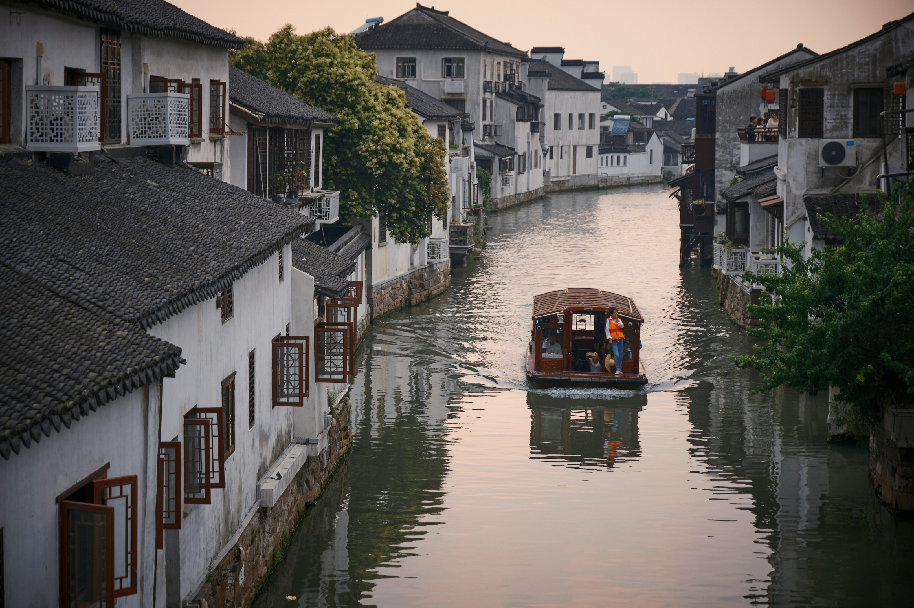
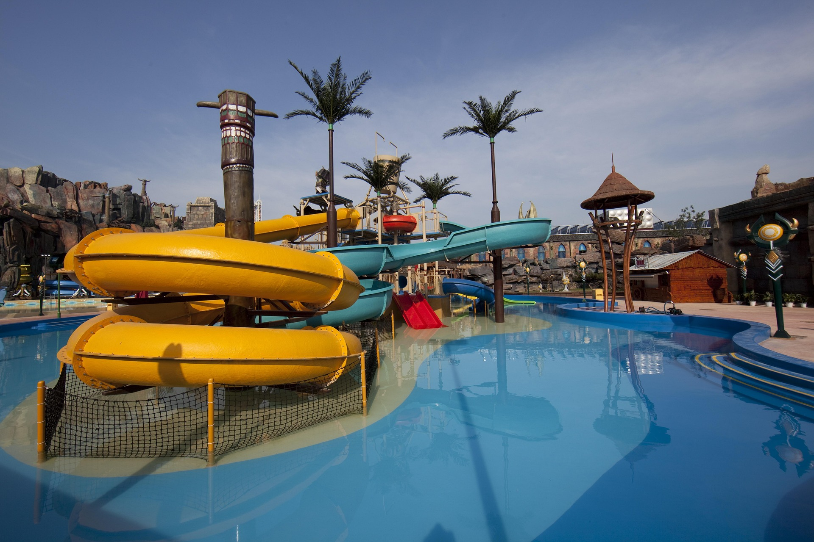
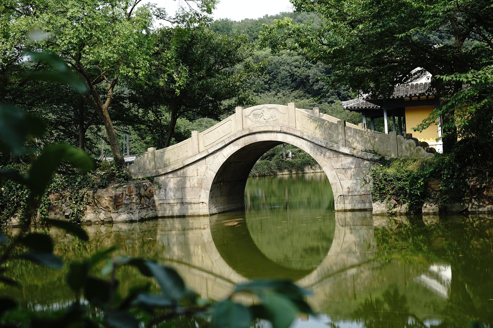
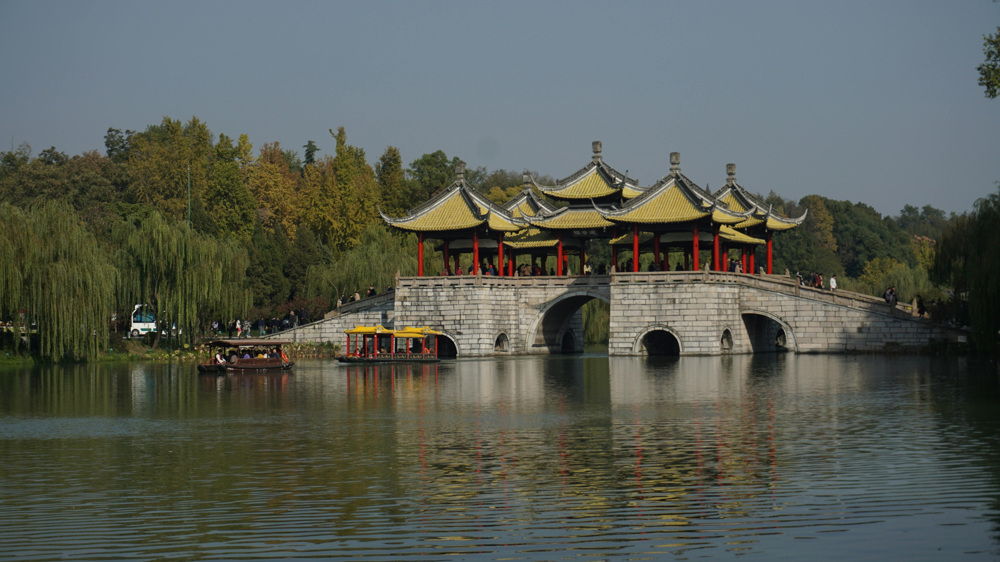

  
Weaving through Jiangsu’s historic cities—each known for unique attractions, local dishes, and competitive spirit.  
江苏十三市的特色文化与美食。    
  

**📍 Nanjing 南京** 

Jiangsu’s capital and former national capital of China, Nanjing blends ancient majesty with modern vigor. Its landmarks reflect millennia of history and cultural depth. 
  
Notable spots: Sun Yat-sen Mausoleum 中山陵, Nanjing City Wall 南京城墙 
Recommended food: Salted duck 盐水鸭, duck blood vermicelli soup 鸭血粉丝汤 
  
  
  

**📍 Suzhou 苏州** 

Famous for its classical gardens and silk culture, Suzhou is a UNESCO World Heritage site with poetic water towns and refined life aesthetics. 
  
Notable spots: Classical Gardens of Suzhou 苏州园林, Pingjiang Road 平江路  
Recommended food: Squirrel-shaped mandarin fish 松鼠鱼, Sweet-scented osmanthus cake 桃花糕 
  
  
  

**📍 Nantong 南通** 
 
Located at the Yangtze River estuary, Nantong is known as the “First Modern City of China.” It boasts strong educational traditions and riverside culture. 
  
Notable spots: Hao River 浩河, Langshan Mountain 郎山 
Recommended food: Nantong-style fried rice 南通炒饭, seafood congee 海鲜粥 
  

**📍 Changzhou 常州** 
Located in southern Jiangsu, Changzhou blends modern development with Buddhist heritage. It's home to the grand Tianning Temple and the famous China Dinosaur Park, making it a favorite for families and culture lovers alike. 
  
Notable spots: Tianning Temple 天宁禅寺, China Dinosaur Park 中华恐龙园 
Recommended food: Sesame Wonton 芝麻馄饨, Changzhou-style mooncakes 常州月饼 
  
  
  

**📍 Huai’an 淮安** 
Huai'an is rich in revolutionary history—known as the hometown of Zhou Enlai. Its waterways and preserved residences offer a glimpse into China's modern history and traditional lifestyle. 
  
Notable spots: Zhou Enlai Memorial 周恩来故居, Hexia Ancient Town 河下古镇 
Recommended food: Stewed eel 鲈鱼, Huaiyang cuisine 淮洋菜  

  

**📍 Lianyungang 连云港** 
A coastal gem and the eastern bridgehead of the New Eurasian Land Bridge, Lianyungang offers beachside relaxation and mythological attractions like Huaguo Mountain. 
  
Notable spots: Huaguo Mountain 花果山, Lian Island 连岛 
Recommended food: Sea cucumber 海参, seafood noodles 海鲜面 
  

**📍 Suqian 宿迁** 
 
A rising tourism star, Suqian is filled with lakeside beauty and hometown pride. It’s a city of elegant scenery and rich liquor culture. 

Notable spots: Luoma Lake 落马湖, Yanghe Distillery 洋河酒厂 
Recommended food: River shrimp 河虾, Suqian-style tofu soup 宿迁豆腐汤 
  

**📍 Taizhou 泰州** 

A cradle of Chinese medicine and opera, Taizhou blends tradition with innovation. Its ancient streets and preserved heritage buildings make it a hidden gem. 
  
Notable spots: Guangxiao Temple 光晓寺, Mei Lanfang Memorial Hall 梅兰芳纪念馆 
Recommended food: Stewed pork with brown sauce 粉糖肉, Dried tofu with crab roe 蟹黄豆腐丝  
  
**📍 Wuxi 无锡** 

Wuxi, by Lake Tai, is known for scenic views and industrial achievements. It offers harmony between natural landscapes and economic vitality. 
  
Notable spots: Liyuan Garden 秀园, Grand Buddha at Ling Shan 灵山大佛 
Recommended food: Wuxi-style ribs 无锡排骨, Glutinous rice balls 粘粒米圆   
  
  
  

**📍 Xuzhou 徐州** 

One of China’s oldest cities, Xuzhou is rich in Han Dynasty relics and heroic military tales. Its terracotta warriors and cloud dragon mountains attract history buffs. 
  
Notable spots: Xuzhou Han Terracotta Warriors Museum 汉兵马俑, Yunlong Lake 云龙湖 
Recommended food: Ground pot chicken 地锅鸡, Xuzhou barbecue 烧烤 
  
 
**📍 Yancheng 盐城** 

Famous for its wetlands and red-crowned cranes, Yancheng is a coastal ecological paradise. It’s also known for its salt history and quiet seaside life. 

Notable spots: Dafeng Elk National Nature Reserve 大丰鹿保护区, Yancheng Salt Museum 盐城盐博物馆 
Recommended food: Salted duck 盐水鸭, Crab soup bun 蟹汤包 
  

**📍 Zhenjiang 镇江** 
Known for vinegar and ancient culture, Zhenjiang sits by the Yangtze with poetic landscapes and towering hills. It’s famous for literary legends and river scenes. 
  
Notable spots: Jinshan Temple 金山寺, Jiaoshan Island 焦山 
Recommended food: Zhenjiang vinegar 镇江醋, Pot-stewed meat 卤肉 
  

**📍 Yangzhou 扬州** 

Yangzhou is a poetic city shaped by canals, gardens, and classical poetry. It was a major hub on the Grand Canal and remains elegant and historic. 
  
Notable spots: Slender West Lake 瘦西湖, Daming Temple 大明寺 
Recommended food: Yangzhou fried rice 扬州炒饭, Steamed dumplings 扬州蒸饺 
  
 
  

